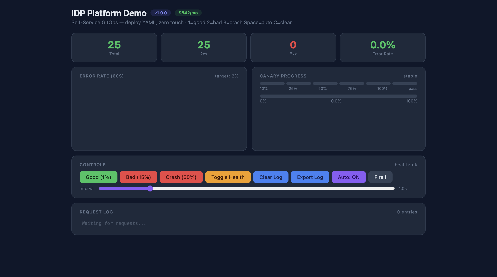
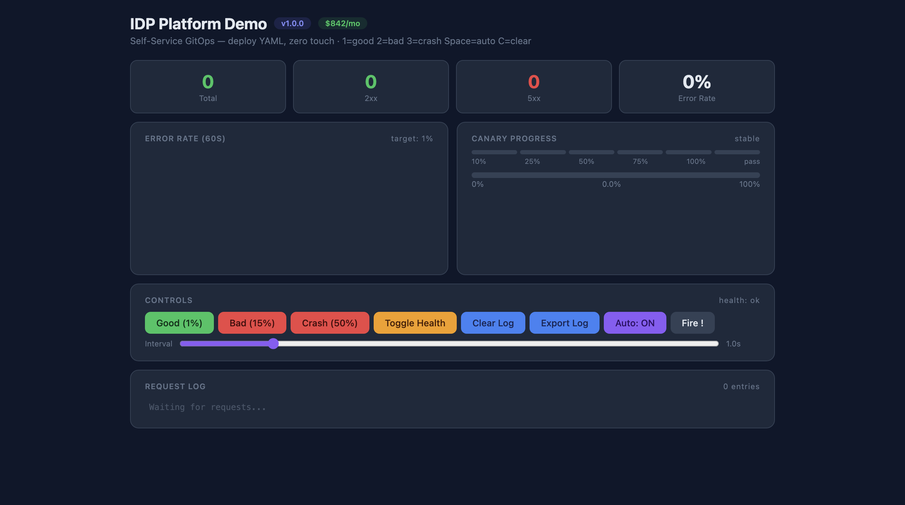
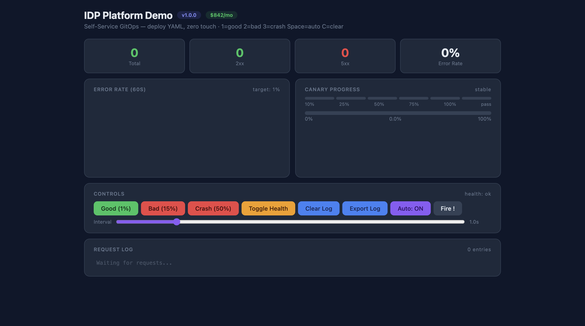

# Production-Grade Internal Developer Platform (IDP)

_A self-service GitOps platform where a developer pushes YAML and ArgoCD handles the rest — no human in the loop._

---

## The Problem 

**Scenario:** You're a platform engineering team at a company with 50+ developers. Every time a developer wants to deploy a new service or update an existing one, they have to open a ticket with the DevOps team. The DevOps team manually provisions infrastructure (VPCs, clusters, IAM roles), configures monitoring, sets up secrets, and deploys the application.

**What goes wrong:**

- **Slow velocity:** Each deployment takes 2-3 days because DevOps is a bottleneck
- **Inconsistent environments:** Dev, Stage, and Prod drift apart because they're configured manually
- **Security gaps:** Secrets stored in code, no encryption, overly permissive IAM roles
- **No safety net:** Bad deployments go straight to production with no canary or rollback mechanism
- **No cost visibility:** Nobody knows how much infrastructure costs until the AWS bill arrives

**The result:** Developers are frustrated, releases are slow, and the infrastructure is fragile.

---

## Dashboard Preview

### Healthy State — 1% Error Rate

> Canary is stable, gauge is green, error rate graph is flat, all requests succeeding.

### Bad Version Deployed — 15%+ Error Rate

> Error rate spikes, gauge turns red, canary shows step progression, requests returning 500s.

### Auto-Rollback Triggered

> Argo Rollouts detects failure, overlay fires with countdown, terminal logs the rollback in real-time.

---

## The Solution (Step by Step)

This project solves all of the above by building a complete Internal Developer Platform. Here's how it works, step by step:

### Step 1: Infrastructure as Code (Terraform)

Everything starts with Terraform. Instead of clicking around the AWS console, the entire infrastructure is defined as code:

- **VPC** with public/private subnets across 3 availability zones, NAT gateways for outbound traffic, VPC endpoints for ECR and S3 (so no traffic leaves AWS network)
- **IAM roles** following least-privilege — separate roles for EKS cluster, node groups, EBS CSI driver, Cluster Autoscaler, External DNS, and cert-manager
- **EKS cluster** with managed node groups (general + spot for cost savings), EBS encryption, cluster logging enabled, and OIDC provider for IRSA (IAM Roles for Service Accounts)
- **Route53** hosted zones with wildcard DNS pointing to the ALB

Each environment (dev, stage, prod) gets its own VPC and EKS cluster with different sizes:
- Dev: small, uses spot instances, cheaper
- Stage: medium, spot instances, simulates prod
- Prod: large, on-demand instances, multi-AZ, DNS enabled

### Step 2: GitOps with ArgoCD

ArgoCD is the heart of the platform. It watches a Git repository and automatically syncs whatever is in the repo to the Kubernetes cluster.

**The workflow:**
1. A developer creates a YAML file (Deployment, Service, Ingress) in the Git repo
2. They open a pull request
3. CI runs validation + Infracost cost estimate
4. PR is reviewed and merged to main
5. ArgoCD detects the change and applies it to the cluster
6. Done — no DevOps ticket needed

ArgoCD is organized using the **App-of-Apps pattern**: one parent Application per environment that syncs all child applications (demo app, monitoring, external secrets).

### Step 3: Progressive Delivery with Argo Rollouts

Instead of a simple deployment that cuts all traffic at once, Argo Rollouts gradually shifts traffic:

**Canary Strategy (used here):**
1. New version starts with 0% traffic
2. 10% of traffic is shifted to the new version → wait 30s
3. 25% of traffic → wait 30s
4. 50% of traffic → wait 30s
5. 75% of traffic → wait 30s
6. 100% of traffic → promoted

At each step, an **AnalysisTemplate** queries Prometheus to check the error rate. If the error rate exceeds 5% for any step, the rollout is automatically aborted and rolled back.

### Step 4: Observability (Prometheus + Grafana + Loki)

- **Prometheus** scrapes metrics from the application every 15 seconds
- **Alert rules** fire at two thresholds:
  - Warning: error rate > 5% for 2 minutes
  - Critical: error rate > 15% for 30 seconds (triggers auto-rollback)
- **Grafana** provides a dashboard showing error rates, request rates, cluster CPU/memory, and active canary deployments
- **Loki** aggregates logs for debugging

### Step 5: External Secrets

Secrets are never stored in Git. Instead:

- AWS Secrets Manager stores sensitive data (passwords, API keys)
- AWS SSM Parameter Store stores configuration (hostnames, ports)
- External Secrets Operator syncs these into Kubernetes as native Secrets
- Authentication is done via IRSA (IAM Roles for Service Accounts using OIDC) — no static credentials

### Step 6: Cost Awareness (Infracost)

Every pull request that touches Terraform gets a cost estimate automatically posted as a comment:

```
Monthly cost change: +$142.50
Resources:
  + aws_nat_gateway    $32.40
  + aws_eks_node_group $98.50
  + aws_lb             $11.60
```

This prevents surprise bills and enables engineering-manager-level cost decisions.

### Step 7: CI/CD (GitHub Actions)

Three automated workflows:

| Workflow | Trigger | What It Does |
|----------|---------|--------------|
| **Terraform Plan** | Any PR modifying `terraform/` | Runs `terraform plan`, posts the plan + cost estimate as a PR comment |
| **Terraform Apply** | Push to main modifying `terraform/` | Runs `terraform apply` to provision infrastructure |
| **Deploy App** | Push to main modifying `demo-app/` | Builds Docker image, pushes to ECR, updates Kustomize manifests |

---

## Tech Stack (Deep Dive for Interviews)

### Infrastructure
| Technology | Why | Interview Talking Point |
|------------|-----|----------------------|
| **Terraform** | Industry standard IaC. Declarative, stateful, modular. | "I chose Terraform over Pulumi/CDK because of its mature ecosystem, large module registry, and widespread adoption in enterprises. The HCL language forces a clear separation of config and logic." |
| **AWS EKS** | Managed Kubernetes control plane | "EKS handles etcd, API server, and control plane upgrades. I don't want to manage Kubernetes itself — I want to run workloads on it. The AWS-managed CNI (vpc-cni) gives native VPC networking without overlay complexity." |
| **EC2 Spot Instances** | 60-90% cost savings | "Spot instances in dev/stage non-production save ~70% on compute. If AWS reclaims the capacity, the Cluster Autoscaler automatically replaces them with on-demand. I used nodeSelector/taints to ensure only stateless workloads land on spot." |

### GitOps
| Technology | Why | Interview Talking Point |
|------------|-----|----------------------|
| **ArgoCD** | Declarative GitOps for Kubernetes | "ArgoCD is the standard for GitOps. It keeps the cluster state in sync with a Git repo — if someone makes a manual change in the cluster, ArgoCD reverts it (self-heal). The App-of-Apps pattern lets me compose environments from reusable components." |
| **Argo Rollouts** | Progressive delivery with automated rollback | "Kubernetes Deployments are too coarse — they cut all traffic at once. Argo Rollouts gives fine-grained traffic shifting with automated canary analysis. The killer feature is the AnalysisTemplate: it queries Prometheus mid-rollout and auto-aborts if error rates spike." |

### Runtime
| Technology | Why | Interview Talking Point |
|------------|-----|----------------------|
| **Kubernetes** | Container orchestration | "Kubernetes provides the abstraction layer. The scheduler, service discovery, and self-healing give a consistent runtime regardless of underlying infrastructure." |
| **Helm + Kustomize** | Package management + config overlays | "Kustomize is built into kubectl and lets me layer environment-specific patches onto base manifests. Helm handles the complex charts (Prometheus stack, Loki) where I'd rather not write 2000 lines of YAML by hand." |

### Observability
| Technology | Why | Interview Talking Point |
|------------|-----|----------------------|
| **Prometheus** | Metrics collection + alerting | "Prometheus pulls metrics via service discovery — no application config needed. The Alertmanager handles deduplication, grouping, and routing to Slack/PagerDuty. The `for` clause prevents flapping alerts." |
| **Grafana** | Visualization | "Grafana is the standard dashboard layer. I created a Platform Overview dashboard showing: error rates (the key SLO), request throughput, cluster health, and active canary deployments." |
| **Loki** | Log aggregation | "Unlike ELK, Loki doesn't index log content — it only indexes metadata labels. This makes it 10x cheaper to run at scale. Logs + metrics together give full observability." |

### Security
| Technology | Why | Interview Talking Point |
|------------|-----|----------------------|
| **External Secrets Operator** | Syncs secrets from AWS to Kubernetes | "Secrets should never be in Git. ESO watches SecretStore resources and syncs from AWS Secrets Manager / SSM into native K8s Secrets. It uses IRSA (IAM via OIDC) — no long-lived AWS credentials anywhere." |
| **IAM Roles for Service Accounts** | Pod-level IAM permissions | "Each pod gets a unique IAM role based on the ServiceAccount it runs as. No shared keys, no NodeInstanceProfile with 50 policies. For example, the external-secrets pod only has `secretsmanager:GetSecretValue` for specific ARNs." |

### Cost
| Technology | Why | Interview Talking Point |
|------------|-----|----------------------|
| **Infracost** | Infrastructure cost estimation in CI | "Infracost runs `terraform plan` in CI and shows the cost impact of every infrastructure change before it's applied. This makes cost a first-class concern — engineering managers can approve or reject PRs based on budget, not just technical merit." |

---

## Architecture Diagram

```
┌─────────────────────────────────────────────────────────────────────┐
│                        Developer                                    │
│              git push → main (YAML config)                          │
└───────────────────────────┬─────────────────────────────────────────┘
                            │
                            ▼
┌──────────────────────────────────────────────────────────────────────┐
│                      GitHub Actions (CI/CD)                          │
│                                                                      │
│  ┌─────────────────┐  ┌─────────────────┐  ┌──────────────────────┐ │
│  │ Terraform Plan  │  │ Terraform Apply │  │ Deploy App           │ │
│  │ (PR: plan+cost) │  │ (merge→apply)   │  │ (merge→build+push)   │ │
│  └────────┬────────┘  └────────┬────────┘  └──────────┬───────────┘ │
└───────────┼─────────────────────┼──────────────────────┼─────────────┘
            │                     │                      │
            ▼                     ▼                      ▼
┌──────────────────────────────────────────────────────────────────────┐
│                      AWS Cloud                                       │
│                                                                      │
│  ┌──────────────────────────────────────────────────────────────┐   │
│  │  EKS Cluster                                                  │   │
│  │  ┌──────────┐  ┌──────────┐  ┌──────────┐                    │   │
│  │  │ ArgoCD   │  │ Argo     │  │ External │                    │   │
│  │  │ (GitOps) │──│ Rollouts │──│ Secrets  │                    │   │
│  │  └──────────┘  │(Canary)  │  └──────────┘                    │   │
│  │                └──────────┘                                   │   │
│  │  ┌────────────────────────────────────────────┐               │   │
│  │  │ Monitoring Stack                           │               │   │
│  │  │  ┌───────────┐ ┌──────────┐ ┌──────────┐  │               │   │
│  │  │  │Prometheus │ │ Grafana  │ │  Loki    │  │               │   │
│  │  │  │(Metrics)  │ │(Dash)    │ │(Logs)    │  │               │   │
│  │  │  └───────────┘ └──────────┘ └──────────┘  │               │   │
│  │  └────────────────────────────────────────────┘               │   │
│  │                                                               │   │
│  │  ┌─────────────────────────────────┐                          │   │
│  │  │ Demo App (Rollout + Service)    │                          │   │
│  │  │ Prometheus ← /metrics endpoint  │                          │   │
│  │  └─────────────────────────────────┘                          │   │
│  └──────────────────────────────────────────────────────────────┘   │
│                                                                      │
│  ┌──────────────────────────────────────────────────────────────┐   │
│  │  Terraform Resources                                         │   │
│  │  VPC (3 AZ) → IGW → NAT → Public/Private Subnets             │   │
│  │  IAM → EKS role, Node role, EBS role, OIDC provider          │   │
│  │  Route53 → DNS records pointing to ALB                       │   │
│  └──────────────────────────────────────────────────────────────┘   │
└──────────────────────────────────────────────────────────────────────┘
```

---

## The Killer Demo (Walk Through)

This demo is designed to be shown in an interview or to a hiring manager. It proves the platform works end-to-end.

### Setup
1. Open `http://localhost:8080/` in a browser
2. The app starts with "Good Version" (1% error rate, green)

### Step 1: Healthy State
- Stats show: 100% success rate, green gauge, stable canary
- Chart shows flat line at 1%
- Canary steps show "stable"

### Step 2: Deploy a Bad Version
- Click **"Bad Version (15%)"** button (or press `2` on keyboard)
- This simulates a developer pushing a buggy update
- The app sets `ERROR_RATE=0.15` — now 15% of requests return HTTP 500

### Step 3: Watch the Cluster Deteriorate
- Auto mode sends requests every second
- The error rate gauge climbs from green → yellow → red
- The time-series chart shows the spike
- Canary progress shifts from "stable" → "step 1" → "step 2" as traffic shifts

### Step 4: Auto-Rollback Triggers
- At 15% error rate, **the rollback overlay appears** with a 3-2-1 countdown
- The **ArgoCD terminal** appears with scrolling logs:

  ```
  [Argo Rollouts] Detected error rate spike: 23.7%
  [Argo Rollouts] AnalysisRun demo-app-6b9d7f-1: status=failed
  [Argo Rollouts] Metric success-rate: 0.763 < 0.950 threshold
  [ArgoCD] Reverting Rollout demo-app to revision 3
  [K8s] ReplicaSet demo-app-4a2c8f scaled up to 5
  [Prometheus] Alert CRITICAL: error_rate=23.7% (resolved)
  ```

- The canary steps turn red and show "ROLLING BACK..."
- After countdown, the platform **automatically reverts** to v1.0.0

### Step 5: Service Restored
- Error rate drops back to 1%
- Gauge returns to green
- Chart shows the spike then recovery
- Terminal logs confirm: "Rollback complete. Service healthy."
- **Users never noticed a thing**

### Why This Impresses Recruiters
| What They See | What It Proves |
|---------------|----------------|
| Full Terraform modules | You understand IaC, modules, remote state |
| ArgoCD App-of-Apps | You know GitOps patterns for multi-env |
| Argo Rollouts + AnalysisTemplate | You understand progressive delivery and observability-driven rollback |
| Prometheus alerts + Grafana dashboards | You can build production observability |
| External Secrets + IRSA | You understand security best practices |
| Infracost in CI | You're cost-aware, not just "make it work" |
| GitHub Actions workflows | You can build CI/CD pipelines |
| 3 environment separation | You understand SDLC and promotion |

---

## Environments

| Environment | VPC CIDR | Node Min | Node Max | Spot | DNS | Purpose |
|-------------|----------|----------|----------|------|-----|---------|
| **dev** | 10.0.0.0/16 | 1 | 5 | Yes | No | Developer testing, fast iteration |
| **stage** | 10.1.0.0/16 | 2 | 8 | Yes | No | Pre-production validation |
| **prod** | 10.2.0.0/16 | 3 | 15 | No | Yes | Production traffic |

Key differences between environments:
- Dev/stage use spot instances (cheaper), prod uses on-demand (reliable)
- Only prod creates Route53 DNS records
- Prod has larger node pools and stricter IAM policies
- Each environment has its own Terraform state file in S3

---

## Directory Structure

```
├── terraform/                    # Infrastructure as Code
│   ├── modules/                  # Reusable Terraform modules
│   │   ├── vpc/                  # VPC, subnets, NAT, VPC endpoints
│   │   ├── iam/                  # EKS roles, CSI role, DNS policies
│   │   ├── eks/                  # EKS cluster, node groups, addons
│   │   └── route53/              # DNS zones and records
│   ├── environments/             # Per-environment configuration
│   │   ├── dev/
│   │   ├── stage/
│   │   └── prod/
│   └── global/                   # Remote state backend (S3 + DynamoDB)
│
├── argocd/                       # GitOps configuration
│   ├── projects/                 # RBAC-scoped AppProjects
│   ├── applications/             # Per-environment Application manifests
│   └── clusters/                 # Cluster registration secrets
│
├── argo-rollouts/                # Progressive delivery
│   └── demo-app/                 # Rollout, AnalysisTemplate, Service, SvcMonitor
│
├── monitoring/                   # Observability
│   ├── prometheus/               # Helm values + alert rules
│   ├── grafana/                  # Helm values + dashboard JSON
│   └── loki/                     # Helm values
│
├── external-secrets/             # Secret management
│   ├── cluster-secret-store.yaml # AWS Secrets Manager + SSM stores
│   └── secret-template.yaml      # ExternalSecret definitions
│
├── infracost/                    # Cost estimation
│   ├── infracost-config.yml      # Multi-project config
│   └── breakdown.sh              # CLI breakdown script
│
├── demo-app/                     # Sample application
│   ├── app/                      # Go source + Dockerfile
│   └── k8s/                      # Standalone K8s manifests
│
├── .github/workflows/           # CI/CD pipelines
│   ├── terraform-plan.yaml       # PR plan + cost comment
│   ├── terraform-apply.yaml      # Merge-to-main apply
│   └── deploy.yaml              # Build, push ECR, update manifests
│
└── scripts/                     # Utility scripts
    ├── bootstrap.sh              # Full platform bootstrap
    ├── destroy.sh                # Environment teardown
    └── demo-failover.sh          # Auto-rollback demo
```

---

## CI/CD Pipeline

```
Pull Request (touches terraform/)
  │
  ├── Terraform Plan → comment on PR with plan + cost
  │
  └── Peer Review → approve → merge

Push to main (touches terraform/)
  │
  └── Terraform Apply → provisions/updates AWS infra

Push to main (touches demo-app/)
  │
  ├── Build Docker image → tag with git SHA
  ├── Push to Amazon ECR
  ├── Update Kustomize manifest with new image tag
  └── ArgoCD detects change → syncs to cluster

  ArgoCD sync triggers:
  ├── Creates/updates Rollout
  ├── Argo Rollouts starts canary (10% → 25% → 50% → 75% → 100%)
  ├── At each step: AnalysisTemplate queries Prometheus
  └── If error_rate > 5%: auto-rollback to previous version
```

---

## Local Development

The demo app runs locally without any cloud infrastructure:

```bash
# Build and run
cd demo-app/app
go build -o /tmp/demo-app .
VERSION=1.0.0 ERROR_RATE=0.01 /tmp/demo-app

# Open in browser
open http://localhost:8080/
```

### Experiment

Set different environment variables to simulate behaviors:

| Variable | Default | Effect |
|----------|---------|--------|
| `ERROR_RATE` | `0.01` (1%) | Probability of returning HTTP 500 |
| `VERSION` | `1.0.0` | Version label shown in UI and metrics |
| `FAIL_HEALTH` | `false` | When `true`, `/health` returns 503 |
| `PORT` | `8080` | HTTP listen port |

---

## Key Architectural Decisions

1. **Terraform over Pulumi/CDK**: Terraform has the largest provider ecosystem, most enterprise adoption, and HCL enforces a strict separation of config and logic. The plan/apply workflow is battle-tested.

2. **ArgoCD over Flux**: ArgoCD has a mature UI, SSO integration, RBAC model, and the ApplicationSet controller for multi-cluster. Flux is simpler but ArgoCD's dashboard is invaluable for developer self-service.

3. **Managed EKS over self-hosted Kubernetes**: Running a Kubernetes control plane yourself means managing etcd backups, API server TLS, controller manager HA, and upgrade rollbacks. EKS handles all of this.

4. **Argo Rollouts over Flagger**: Argo Rollouts integrates natively with ArgoCD (same project). The AnalysisTemplate concept allows arbitrary metric queries at each canary step. Flagger works via webhooks and is more complex to debug.

5. **Prometheus over Datadog**: Prometheus + Grafana are open-source, run in-cluster (no egress costs), and give full control over retention and alerting rules. For a platform team, owning the observability stack is strategically important.

6. **External Secrets over Sealed Secrets/Mozilla SOPS**: ESO provides real-time sync from AWS Secrets Manager. If a secret is rotated in AWS, it's automatically updated in Kubernetes within minutes. Sealed Secrets would require re-encrypting and committing to Git.

---

## Interview Talking Points

### "Why did you build this?"
"The company had 50+ developers and 2 DevOps engineers. Every deployment required a ticket, manual infrastructure changes, and took 2-3 days. Developers couldn't deploy without DevOps. I built this platform to eliminate that bottleneck — a developer pushes YAML, and the platform handles everything else automatically."

### "How does it handle bad deployments?"
"Argo Rollouts with canary analysis. When a new version is deployed, traffic is gradually shifted (10% → 25% → 50% → 75% → 100%). At each step, Prometheus metrics are checked. If the error rate exceeds 5%, the rollout is automatically aborted and rolled back to the last stable version. No human intervention needed."

### "How do you manage secrets?"
"Secrets are stored in AWS Secrets Manager and AWS SSM Parameter Store, never in Git. The External Secrets Operator syncs them into Kubernetes as native Secrets. Authentication uses IAM Roles for Service Accounts (IRSA) via EKS's OIDC provider — no long-lived credentials anywhere."

### "How do you handle multi-environment?"
"Each environment (dev, stage, prod) gets its own VPC and EKS cluster. They share Terraform modules but have separate configuration files. Dev uses spot instances for cost savings, prod uses on-demand for reliability. Only prod gets Route53 DNS records. Each environment has its own Terraform state file in S3 with DynamoDB locking."

### "How do you control infrastructure costs?"
"Infracost integrates into the CI pipeline. Every pull request that changes Terraform gets a cost estimate posted as a PR comment. Engineering managers can see 'this change adds $142/month' before approving. This makes cost a first-class concern rather than a surprise at the end of the month."

### "What would you improve?"
"I'd add a service catalog (Backstage) so developers can discover and create services from templates. I'd also add Kyverno or OPA Gatekeeper for policy enforcement — ensuring every deployment has resource limits, health probes, and security contexts. And I'd implement the Service Mesh (Istio) for mTLS and fine-grained traffic routing."
